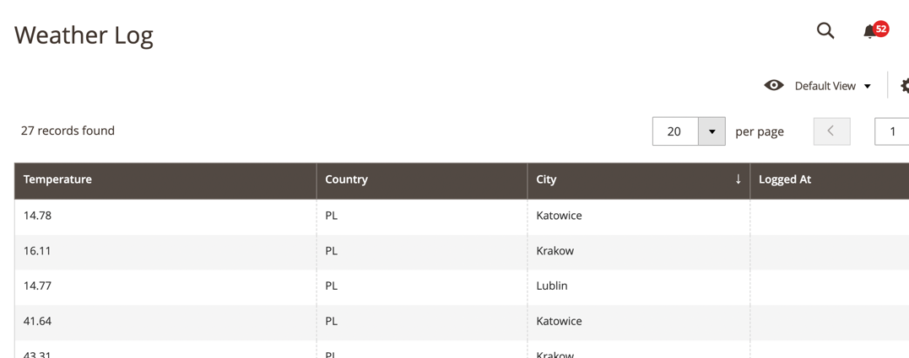

## How to use?
1. The weather updates every 10 minutes by default via CRON.
2. Customer can increment the current weather with CLI command
3. Customer can see the weather log in admin panel

Under the weather, we mean `temperature`.

### Configuring the Weather CRON job
By default, it is set to 10 minutes.
However it can be configured.
Please specify configuration by this path: ```weather/general/cron_timing```

#### Cities and Countries of weather calculations
By default there are 4 cities in Poland:

- Lublin
- Warsaw
- Krakow
- Katowice

They are specified in Dummy cities resolver: ```\Monogo\Weather\Model\Source\AvailableCities```.

#### API
OpenWeather is used as an API provider.
Before fetching the weather it requires to generate a key (default key is available after installation).
Key can be generated here: ``https://home.openweathermap.org/api_keys``
OpenWeather allows to search by country_id and city, separated by comma.
In our example we are using: ``PL,Katowice``, for example.

#### Weather on storefront


By default weather is set in the header.
Weather is updated with the help of customer private data, because:

- We are expecting in case of module extension, that weather can be different for customers from different cities;
- Private data allows to cache data, bringing an additional performance improvement.

In order to automatically invalidate weather from customer data, we are using data_id parameter:

```\Monogo\Weather\Section\WeatherSection::getDataId```

#### Weather increments

Weather can be increment with the help of next command:

`bin/magento weather:temperature:increment <float increment>`

#### Weather log is accessible in GRID

You can check weather log, by the next path: `Admin -> Weather -> Weather`




### Performance optimization

In order to optimize performance few things were made:

- Table optimization: MySQL index by country_id,city. Country ID has lower selectivity, that is why it goes first.
- Persistence Queries instead of Active Record approach (Model, ResourceModel, Collection)
- Batch update to speed up increment changes
- Private data and caching
- etc.